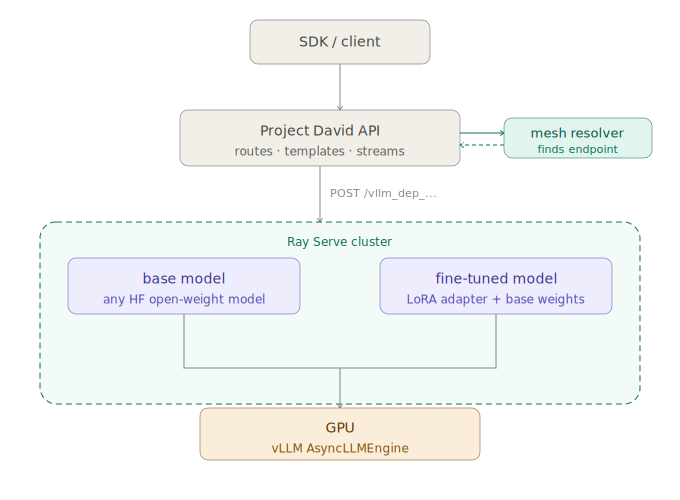

# vLLM & Sovereign Forge Cluster

## Overview

Project David uses vLLM as its GPU-powered inference engine for running open-weight models locally and across distributed clusters. vLLM is designed for production-grade throughput — it handles continuous batching, efficient KV cache management, and LoRA adapter loading so the platform can serve fine-tuned models alongside base models without restarting or reconfiguring anything.

### Powered by Ray Serve

The vLLM integration runs through Ray Serve, a scalable model serving framework built on the Ray distributed computing platform. Rather than running vLLM as a standalone server process, each model deployment is wrapped as a Ray Serve application. This gives the deployment manager the ability to start, stop, and health-check individual model deployments independently without affecting anything else running on the cluster.

The deeper benefit is scalability. Ray Serve is cluster-aware. As you add GPU nodes to your infrastructure, the same deployment system that manages a single GPU today can distribute inference across an entire fleet tomorrow. Horizontally, Ray Serve can run multiple replicas of the same model across different nodes to handle more concurrent requests. Both strategies are managed by the same deployment manager with no changes required to your application code.

---

## Architecture



---

## Prerequisites

Before starting the vLLM inference stack, ensure the following are in place on every node that will participate in the cluster.

**NVIDIA GPU**

The amount of VRAM available on your GPU determines which models you can serve:

| VRAM | Viable models |
|---|---|
| 8 GB | Quantised 1.5B to 7B models (4-bit) |
| 16 GB | Quantised 7B to 13B models, full-precision 7B |
| 24 GB | Quantised 34B models, full-precision 13B |
| 40 GB | Quantised 70B models, full-precision 34B |
| 80 GB (A100 / H100) | Full-precision 70B, quantised 180B+ |

**NVIDIA drivers**

The host machine must have NVIDIA drivers installed. The inference worker container handles all GPU container configuration internally — you only need the host driver present so Docker can pass the GPU through.

```bash
nvidia-smi
```

Consumer cards (RTX series) require a minimum driver version of 525. Data centre cards should use the latest production branch driver from NVIDIA.

**Docker Compose**

Version 2.17 or later is required for the `deploy.resources` GPU reservation syntax.

```bash
docker compose version
```

**HuggingFace account and token**

Base model weights are downloaded from HuggingFace on first activation. Set your token in `.env`:

```bash
pdavid configure --set HF_TOKEN=hf_your_token_here
```

Some models — including the Llama 3 family — are gated and require you to accept the model licence on the HuggingFace model page before your token grants download access. A 401 error during activation is almost always a missing licence acceptance rather than a bad token.

For airgapped deployments, weights must be pre-cached in `HF_CACHE_PATH` before the stack starts. Set `HF_HUB_OFFLINE=1` to prevent any outbound network requests.

---

## Single Node Deployment

A single-node deployment is the standard starting point. One machine acts as the Ray HEAD node, owns the GPU, runs Ray Serve, and hosts the InferenceReconciler that watches for models to activate.

### Starting the stack

```bash
pdavid --mode up --training
```

This starts three additional services on top of the base stack:

- `inference-worker` — the Ray HEAD node. Owns the GPU, runs Ray Serve, hosts the deployment manager.
- `training-worker` — handles fine-tuning job execution via Redis. Does not participate in Ray.
- `training-api` — the REST API for training jobs and the model registry.

On first run the inference worker image needs to be pulled. It is approximately 27 GB due to the CUDA, PyTorch, and vLLM stack it contains. Pull explicitly before starting:

```bash
pdavid --mode up --training --pull
```

Once Ray initialises you will see the following in the inference worker logs:

```
Ray HEAD started — dashboard: http://localhost:8265
Ray Serve started on port 8000
InferenceReconciler active — polling every 20s
```

The inference stack is running but idle. No model is loaded and no GPU memory is allocated. Models load on demand when you activate a deployment through the registry.

### Verifying the stack

```bash
pdavid --mode logs --follow --services inference-worker
```

The Ray dashboard is also available at `http://localhost:8265` and shows cluster resources, active deployments, and replica health.

### Stopping the stack

```bash
pdavid --mode down_only
```

---

## Multi-Node Cluster Deployment

A multi-node cluster extends the single-node deployment by adding one or more GPU worker nodes that join the Ray HEAD and contribute their GPUs to the inference mesh. From the deployment manager's perspective the cluster is a single pool of GPU resources — it schedules model deployments across any node with sufficient capacity.

### Architecture

```
HEAD NODE (your local machine)
├── inference-worker (Ray HEAD + Ray Serve + InferenceReconciler)
├── training-worker
├── training-api
├── api, db, redis, nginx, ...
│
└── SSH TUNNEL ──────────────────────────────────────────────┐
                                                              │
WORKER NODE (remote GPU — RunPod, cloud VM, bare metal)      │
└── inference-worker (Ray WORKER, joins HEAD via tunnel)      │
    RAY_ADDRESS=ray://localhost:10001 ◄───────────────────────┘
```

The SSH tunnel is the connectivity layer. The worker node connects to `ray://localhost:10001` — a port that the tunnel maps back to your HEAD node's Ray client server. The HEAD also pushes its Redis and MySQL ports to the worker via the same tunnel so the worker's InferenceReconciler can reach the shared database.

### Networking requirements

The following ports must be reachable between cluster nodes. In a tunnelled deployment these are all forwarded through a single SSH connection — no firewall rules or open ports are required on either side.

| Port | Direction | Purpose |
|---|---|---|
| 22 | Worker → HEAD (via tunnel) | SSH tunnel establishment |
| 10001 | HEAD → Worker (reverse forward) | Ray client server — worker joins cluster |
| 6379 | HEAD → Worker (reverse forward) | Redis — shared job queue |
| 3307 | HEAD → Worker (reverse forward) | MySQL — shared database |
| 8265 | HEAD only | Ray dashboard (local access only) |
| 8000 | Worker (local) | Ray Serve HTTP endpoint |

For direct network deployments where both nodes share a LAN or VPN, the tunnel is not required. Open TCP ports 10001, 6379, and 3307 on the HEAD node and point `RAY_ADDRESS` on the worker directly to the HEAD's IP.

### Setting up the SSH tunnel

The tunnel is established from the HEAD node outbound to the worker. This means the HEAD initiates the connection — no inbound ports need to be opened on the HEAD node, which is critical for residential and NAT'd deployments.

```bash
ssh -N -i ~/.ssh/id_ed25519 \
    -o ServerAliveInterval=30 \
    -o ServerAliveCountMax=10 \
    -o TCPKeepAlive=yes \
    -R 10001:localhost:10001 \
    -R 6379:localhost:6379 \
    -R 3307:localhost:3307 \
    root@<worker-host> -p <worker-port>
```

`-R` (remote forward) pushes a local port to the remote machine's localhost. Once the tunnel is established, the worker node can reach your HEAD's Ray cluster, Redis, and MySQL as if they were running locally.

Keep this terminal open for the duration of the cluster session. The keepalive flags prevent the tunnel from being dropped by idle timeouts on cloud providers.

### Starting a worker node

With the tunnel active, start a worker node using the platform CLI:

```bash
pdavid worker --join <head-tailscale-or-local-ip>
```

Or for a cloud worker where connectivity is via tunnel:

```bash
pdavid worker --join localhost --ray-port 10001
```

The worker CLI pulls the inference worker image, verifies the HEAD is reachable, and starts the container with `RAY_ADDRESS=ray://localhost:10001`. The worker joins the Ray cluster and its GPU becomes available to the deployment manager within 60 seconds.

To verify the worker has joined, check the Ray dashboard on the HEAD:

```
http://localhost:8265
```

Under **Node Status** you should see two active nodes. Under **Resource Status** you will see the combined GPU count.

### Expanding the cluster with RunPod

RunPod is a GPU cloud marketplace that gives you on-demand access to a wide range of NVIDIA GPUs — from RTX 4090s for development to A100s and H100s for production workloads. You pay only for the time the pod is running, making it a practical way to add GPU capacity to your Project David cluster without committing to dedicated hardware.

In the Project David architecture, a RunPod pod runs as a Ray worker node. Your local machine remains the HEAD — it owns the database, Redis, and the InferenceReconciler. The RunPod GPU joins the cluster via an SSH tunnel and contributes its VRAM to the inference mesh. From the deployment manager's perspective it is indistinguishable from any other node.

#### What RunPod is

RunPod provisions GPU-backed Linux containers on demand. Each pod runs a Docker image of your choice, is assigned a public IP, and exposes ports you specify. Pods are billed by the hour and can be started, stopped, and terminated from the RunPod console or API. Secure Cloud pods run on vetted data centre infrastructure with guaranteed uptime SLAs. Community Cloud pods are cheaper but run on third-party hardware.

For Project David worker nodes, either tier works. The SSH tunnel handles all connectivity — no special network configuration is required on the RunPod side beyond exposing port 22.

#### Deploying the sovereign-forge-worker template

Project David provides a pre-configured RunPod template that ships the correct inference worker image with all required environment variables as placeholders.

**[Deploy Sovereign Forge Worker on RunPod →](https://console.runpod.io/deploy?template=4lvbs00lnn&ref=utp431s6)**

This link takes you directly to the template deployment page. You will need a RunPod account — sign up at [runpod.io](https://www.runpod.io) if you do not have one.

#### Configuring the template

Before deploying, fill in the environment variables in the template. Click **Customize Deployment** to expand the environment variable editor.

| Variable | Value | Where to get it |
|---|---|---|
| `DATABASE_URL` | `mysql+pymysql://api_user:<password>@localhost:3307/entities_db` | Copy `MYSQL_PASSWORD` from your local `.env`, substitute into the URL |
| `REDIS_URL` | `redis://localhost:6379/0` | Leave as-is — provided via tunnel |
| `RAY_ADDRESS` | `ray://localhost:10001` | Leave as-is — provided via tunnel |
| `TAILSCALE_AUTH_KEY` | `tskey-auth-...` | Generate at [login.tailscale.com/admin/settings/keys](https://login.tailscale.com/admin/settings/keys) |
| `HF_TOKEN` | `hf_...` | Your HuggingFace access token |
| `NODE_ID` | `runpod-worker` | Leave as-is or set a custom name |

`DATABASE_URL` and `REDIS_URL` use `localhost` because the SSH tunnel maps your HEAD node's ports to the pod's localhost. The pod never connects directly to your machine's IP.

#### Choosing a GPU

Select a GPU that matches the models you intend to serve. Use the VRAM table in the Prerequisites section as a guide. For quantised 7B models, an RTX 4090 (24 GB) or RTX 3090 (24 GB) is a strong choice. For larger models, RunPod's A100 SXM (80 GB) or H100 PCIe (80 GB) pods are available on Secure Cloud.

Set the container disk to at least **40 GB** to accommodate the inference worker image (~27 GB) plus model weights.

#### Starting the pod and establishing the tunnel

Once the pod is running, get the SSH connection details from the **Connect** tab in the RunPod console. You will see something like:

```
ssh root@157.157.221.29 -p 19938 -i ~/.ssh/id_ed25519
```

With the pod running, open a terminal on your local HEAD machine and establish the tunnel:

```bash
ssh -N -i ~/.ssh/id_ed25519 \
    -o ServerAliveInterval=30 \
    -o ServerAliveCountMax=10 \
    -o TCPKeepAlive=yes \
    -R 10001:localhost:10001 \
    -R 6379:localhost:6379 \
    -R 3307:localhost:3307 \
    root@157.157.221.29 -p 19938
```

Replace the host and port with the values from your Connect tab. Keep this terminal open — the tunnel must remain active for the cluster to function.

The pod's inference worker starts automatically and begins attempting to join the Ray cluster at `ray://localhost:10001`. Once the tunnel is established it will connect within one retry cycle (15 seconds).

#### Verifying the connection

Check the Ray dashboard on your HEAD node:

```
http://localhost:8265
```

Under **Node Status** you should see two active nodes. Under **Resource Status** the combined GPU count will reflect both your local GPU and the RunPod GPU. The cluster is ready to receive deployments.

#### Stopping the pod

When you are finished, terminate the tunnel by closing the terminal, then stop or terminate the pod from the RunPod console. Stopped pods do not incur compute charges but retain their disk. Terminated pods are destroyed completely.

If you stop the pod and restart it later, note that the SSH host and port will change. Update your tunnel command with the new connection details from the Connect tab.

---

## Airgapped Cluster Deployment

An airgapped cluster operates with no outbound internet access on any node. All model weights must be pre-staged and all inter-node communication must occur over private infrastructure.

### Model weight distribution

Each node that will serve a model must have the model weights in its local HuggingFace cache. The deployment manager does not transfer weights between nodes — it assumes the weights are already present on whichever node Ray schedules the deployment to.

Pre-stage weights on every node before starting the cluster:

```bash
# On the HEAD node
huggingface-cli download Qwen/Qwen2.5-7B-Instruct \
    --cache-dir /path/to/HF_CACHE_PATH

# On each worker node
huggingface-cli download Qwen/Qwen2.5-7B-Instruct \
    --cache-dir /root/.cache/huggingface
```

For fully airgapped environments where HuggingFace is unreachable, download weights on a connected machine and transfer the cache directory to each node:

```bash
rsync -avz ~/.cache/huggingface/hub/models--Qwen--Qwen2.5-7B-Instruct \
    user@airgapped-node:/root/.cache/huggingface/hub/
```

### Preventing outbound requests

Set `HF_HUB_OFFLINE=1` in `.env` on the HEAD node and in the environment variables for each worker node. With this set, vLLM will immediately fail if weights are not present rather than hanging on a network timeout.

```bash
pdavid configure --set HF_HUB_OFFLINE=1
```

### Connectivity

For airgapped clusters, use a private VPN or direct network connection between nodes. Tailscale operates in this role effectively — it requires only outbound HTTPS to the Tailscale coordination server during initial setup, and subsequently operates peer-to-peer. Alternatively, any private network where nodes can reach each other on the required ports is sufficient.

---

## HuggingFace Model Management

### How the cache works

The HuggingFace cache lives on the host machine at the path defined by `HF_CACHE_PATH` in your `.env`. The inference worker container mounts this path at `/root/.cache/huggingface`. vLLM reads weights from that mount.

Default cache locations:

| Platform | Default path |
|---|---|
| Linux | `~/.cache/huggingface` |
| macOS | `~/.cache/huggingface` |
| Windows | `%USERPROFILE%\.cache\huggingface` |

To use a different location:

```bash
pdavid configure --set HF_CACHE_PATH=/mnt/fast_nvme/huggingface
```

Restart the stack after changing this path.

### Downloading weights

The simplest approach is to let the platform handle it on first activation. As long as `HF_TOKEN` is set and the host has internet access, the inference worker will pull weights from HuggingFace automatically.

To pre-download weights before activation:

```bash
huggingface-cli download Qwen/Qwen2.5-7B-Instruct
```

Or programmatically:

```python
from huggingface_hub import snapshot_download

snapshot_download(
    repo_id="Qwen/Qwen2.5-7B-Instruct",
    cache_dir="/path/to/your/HF_CACHE_PATH",
)
```

### Storage requirements

| Model | Precision | Approximate size |
|---|---|---|
| 1.5B | 4-bit quantised | ~1 GB |
| 7B | 4-bit quantised | ~4 GB |
| 7B | float16 | ~14 GB |
| 13B | 4-bit quantised | ~7 GB |
| 34B | 4-bit quantised | ~18 GB |
| 70B | 4-bit quantised | ~38 GB |
| 70B | float16 | ~140 GB |

Fine-tuned LoRA adapters share the base model weights. Only the adapter files — typically a few hundred MB — are additional.

---

## Registering and Activating Models

### Registration

Registration adds a model to the catalog. It is a metadata operation — no GPU resources are allocated. Registration is idempotent: registering the same HuggingFace model ID twice returns the existing record.

```python
import os
from dotenv import load_dotenv
from projectdavid import Entity

load_dotenv()

admin_client = Entity(
    base_url=os.getenv("BASE_URL", "http://localhost:80"),
    api_key=os.getenv("ADMIN_API_KEY"),
)

registered = admin_client.registry.register(
    hf_model_id="Qwen/Qwen2.5-7B-Instruct",
    name="Qwen2.5 7B Instruct",
    family="qwen",
    parameter_count="7B",
)

print(f"Registered: {registered.id}")
```

To list all registered models:

```python
catalog = admin_client.registry.list()
for model in catalog.items:
    print(f"{model.id}  {model.name}")
```

### Activation

Activation deploys a registered model to the GPU cluster. The deployment manager creates a Ray Serve application, loads the weights, and makes the model available for inference.

```python
result = admin_client.models.activate_base(
    base_model_id=registered.id,
)
```

Activation is asynchronous. The API call returns immediately — weight loading and Ray Serve startup happen in the background. The deployment manager polls the database every 20 seconds.

Follow progress in the inference worker logs:

```bash
pdavid --mode logs --follow --services inference-worker
```

### Deactivation

```python
# Deactivate a specific model
admin_client.models.deactivate_base(base_model_id=registered.id)

# Release all GPU memory immediately
admin_client.models.deactivate_all()
```

### What healthy activation looks like

Activation goes through three phases:

**Phase 1 — Weight loading**

```
🚢 Deploying via Ray Serve: vllm_dep_... model=Qwen/Qwen2.5-7B-Instruct gpu_mem_util=0.50
Loading weights with BitsAndBytes quantization...
Model loading took 1.49GiB and 36.02 seconds
KV Cache: 2542 CUDA blocks — maximum concurrency: 19.86x at 2048 tokens
```

**Phase 2 — CUDA graph capture**

```
Capturing CUDA graph shapes: 100%|██████████| 35/35
Graph capturing finished in 16 secs, took 0.62 GiB
```

Ray Serve will emit a warning that the replica has taken more than 30 seconds to initialise. This is expected — CUDA graph capture takes longer than Ray's default health check timeout. The deployment is healthy and will complete.

**Phase 3 — Ready**

```
Application 'vllm_dep_...' is ready at http://0.0.0.0:8000/vllm_dep_...
✅ Ray Serve deployment active: vllm_dep_... (gpu_mem_util=0.50)
```

Total time from activation to ready is typically 60 to 120 seconds for a quantised 7B model on an 8 GB GPU.

---

## Load Balancing a Model Across the Cluster

When the same model is deployed with multiple replicas, Ray Serve automatically load balances inference requests across all replicas using round-robin scheduling. Each replica runs on a separate GPU — either on the same node or on different nodes in the cluster.

This is the primary horizontal scaling strategy for high-traffic deployments: more replicas means more concurrent requests the cluster can service without queuing.

### Deploying with multiple replicas

```python
result = admin_client.models.activate_base(
    base_model_id=registered.id,
    num_replicas=2,
)
```

Ray Serve places each replica on a node with an available GPU. If both GPUs are on the same node, replicas share that node's memory bus and NVLink (if available). If GPUs are on different nodes, replicas are fully independent and network-isolated from each other.

### Capacity planning for replicated deployments

Each replica reserves its own GPU and allocates its own KV cache. Two replicas of a 7B quantised model on 8 GB GPUs will service approximately twice the concurrent requests of a single replica, with no increase in per-request latency.

| Replicas | GPUs required | Concurrent requests (7B 4-bit, 8 GB) |
|---|---|---|
| 1 | 1 | ~20 at 2048 tokens |
| 2 | 2 | ~40 at 2048 tokens |
| 4 | 4 | ~80 at 2048 tokens |

### Verifying load distribution

The Ray dashboard at `http://localhost:8265` shows active replicas under the **Serve** tab. Each replica is listed with its node assignment and current request count. Under normal load you should see requests distributed evenly across replicas.

---

## Serving Multiple Models Across the Cluster

The deployment manager supports multiple simultaneous model deployments across the cluster. Each deployment is a separate Ray Serve application with its own GPU allocation, its own KV cache, and its own HTTP route. From the client's perspective, models are addressed by their HuggingFace path — the routing is handled transparently by the platform.

### Deploying multiple models

Register and activate each model independently:

```python
# Register and activate model A
model_a = admin_client.registry.register(
    hf_model_id="Qwen/Qwen2.5-1.5B-Instruct",
    name="Qwen2.5 1.5B",
    family="qwen",
    parameter_count="1.5B",
)
admin_client.models.activate_base(base_model_id=model_a.id)

# Register and activate model B
model_b = admin_client.registry.register(
    hf_model_id="mistralai/Mistral-7B-Instruct-v0.3",
    name="Mistral 7B Instruct",
    family="mistral",
    parameter_count="7B",
)
admin_client.models.activate_base(base_model_id=model_b.id)
```

Each model is deployed as a separate Ray Serve application with its own route prefix. The InferenceReconciler manages all active deployments simultaneously and will redeploy any that become unhealthy.

### GPU assignment across nodes

Ray's scheduler places each deployment on a node with a free GPU. In a two-node cluster with one GPU each, two model deployments will naturally land one per node. In a four-node cluster, four deployments can run simultaneously — each on its own GPU — with no VRAM contention between them.

The scheduler does not currently support explicit node pinning per deployment. GPU assignment is handled by Ray based on resource availability at activation time.

### Capacity planning for multi-model deployments

The constraint is always VRAM. Each deployment must fit within the VRAM of a single GPU (until sharding support is added). Plan deployments so that no GPU is asked to host more VRAM than it has available.

| Cluster | Models | Configuration |
|---|---|---|
| 1× 8 GB GPU | 1 model | 1× 7B 4-bit |
| 2× 8 GB GPU | 2 models | 1× 7B 4-bit per node |
| 2× 8 GB GPU | 1 model, 2 replicas | Load balanced, 2× throughput |
| 4× 8 GB GPU | 4 models | 1 per node, full model diversity |
| 4× 8 GB GPU | 2 models, 2 replicas each | Load balanced diversity |

### Routing requests to specific models

From the client, specify the model by its HuggingFace path when creating an assistant:

```python
# Route to the 1.5B model
assistant_small = user_client.assistants.create_assistant(
    name="Fast Assistant",
    instructions="You are a helpful assistant.",
    model="vllm/Qwen/Qwen2.5-1.5B-Instruct",
)

# Route to the 7B model
assistant_large = user_client.assistants.create_assistant(
    name="Capable Assistant",
    instructions="You are a helpful assistant.",
    model="vllm/mistralai/Mistral-7B-Instruct-v0.3",
)
```

The mesh resolver finds the active deployment for each model ID automatically. If a model is not active, the request fails with a clear error rather than falling back silently.

---

## GPU Memory Configuration

Every deployment is allocated a fixed proportion of total GPU VRAM at startup, controlled by `gpu_memory_utilization`. This determines how much memory vLLM can use across weights, activation memory, and the KV cache.

The default is `0.50` — 50% of available VRAM. This is deliberately conservative, leaving headroom for the operating system, CUDA runtime, and Ray.

```python
result = admin_client.models.activate_base(
    base_model_id=registered.id,
    gpu_memory_utilization=0.85,
)
```

| `gpu_memory_utilization` | Available on 8 GB GPU | Recommended for |
|---|---|---|
| `0.50` | 4.00 GB | Default, shared GPU, development |
| `0.70` | 5.60 GB | Dedicated inference, moderate load |
| `0.85` | 6.80 GB | Production, high concurrency |
| `0.90` | 7.20 GB | Maximum — monitor for OOM |

The deployment manager clamps this value to `[0.10, 0.95]`. The KV cache allocation — what remains after weights and activation memory — directly determines how many concurrent requests and how long a context the deployment can service. A KV cache below ~0.5 GiB will struggle with anything beyond short single-turn requests.

An OOM during CUDA graph capture produces this log signature:

```
torch.OutOfMemoryError: CUDA out of memory.
Consider decreasing gpu_memory_utilization or switching to eager mode.
```

Deactivate the deployment and reactivate with a lower value. `0.40` is a reasonable floor for consumer cards running quantised models.

---

## Supported Model Families

| Family | Example models | Tool calling |
|---|---|---|
| Qwen | Qwen2.5-1.5B/7B/14B/32B/72B-Instruct | Yes |
| Llama 3 | Llama-3.1-8B/70B/405B-Instruct | Yes |
| Mistral | Mistral-7B-Instruct-v0.3, Mixtral-8x7B | Yes |
| DeepSeek | DeepSeek-V2/V3/R1 | Yes |
| Phi | Phi-3/3.5-mini/medium-instruct | Yes |
| Gemma | Gemma-2-2B/9B/27B-Instruct | Yes |
| GPT-OSS | Falcon, GPT-J, GPT-NeoX | Partial |

The `family` field on registration drives prompt template selection. If omitted or unrecognised, the platform falls back to the Qwen template. For most instruct-tuned models this produces acceptable output, but tool calling reliability will be lower than with the correct template.

### Recommended models by VRAM budget

| VRAM | Model | Family | Quantisation |
|---|---|---|---|
| 8 GB | Qwen2.5-1.5B-Instruct | qwen | unsloth 4-bit |
| 8 GB | Qwen2.5-7B-Instruct | qwen | unsloth 4-bit |
| 8 GB | Mistral-7B-Instruct-v0.3 | mistral | unsloth 4-bit |
| 16 GB | Qwen2.5-14B-Instruct | qwen | unsloth 4-bit |
| 24 GB | Qwen2.5-32B-Instruct | qwen | unsloth 4-bit |
| 40 GB | Llama-3.1-70B-Instruct | llama | unsloth 4-bit |
| 80 GB+ | Llama-3.1-405B-Instruct | llama | 4-bit sharded |

Unsloth quantised variants are recommended for consumer and prosumer hardware. The full HuggingFace paths follow the pattern `unsloth/<model-name>-bnb-4bit`.

---

For activating fine-tuned LoRA models, see [Model Activation](/docs/admin-model-activation).  
For the full Sovereign Forge training pipeline, see [Sovereign Forge](/docs/sovereign-forge).

