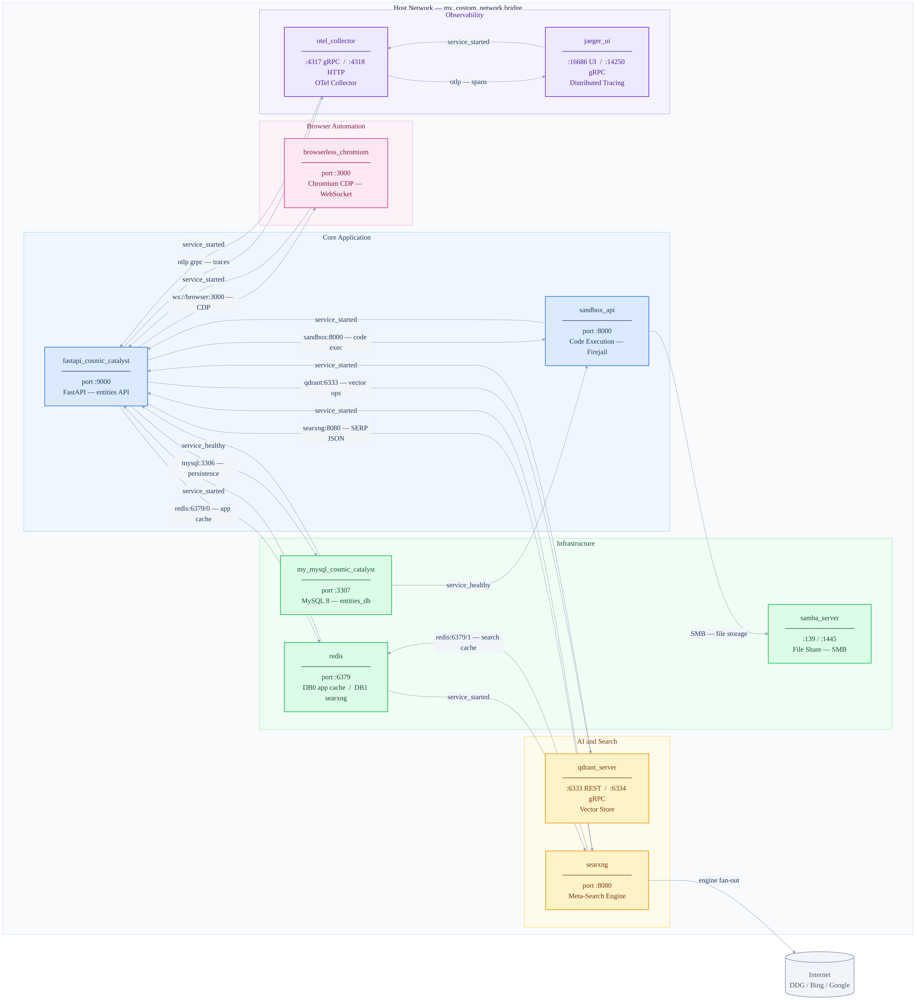

# Container Architecture

## Overview

The Project David platform runs as a single Docker Compose stack across ten containers, all joined on a shared bridge network (`my_custom_network`). The stack covers the full surface area of an agentic AI platform — API serving, isolated code execution, vector search, web discovery, headless browsing, relational persistence, file storage, and distributed observability. All inter-service communication uses internal DNS resolution via container name, with only specific ports exposed to the host for external access.

---

## Architecture Diagram



---

## Container Reference

One row per container covering everything you need to know at a glance — image, ports, role, and restart policy.

| Container | Image | Port(s) | Role | Restart Policy |
|---|---|---|---|---|
| `fastapi_cosmic_catalyst` | custom build | 9000 | Core API — entities, tools, agent orchestration | always |
| `sandbox_api` | custom build | 8000 | Isolated code execution — Firejail / FUSE | always |
| `qdrant_server` | qdrant/qdrant:latest | 6333 / 6334 | Vector store — semantic search and embeddings | always |
| `searxng` | searxng/searxng:latest | 8080 | Meta-search SERP — DDG, Bing, Google fan-out | unless-stopped |
| `my_mysql_cosmic_catalyst` | mysql:8.0 | 3307 → 3306 | Primary relational database — entities_db | always |
| `redis` | redis:7 | 6379 | App cache DB0 / SearxNG cache DB1 | unless-stopped |
| `samba_server` | dperson/samba | 139 / 1445 → 445 | SMB file share — sandbox generated file storage | unless-stopped |
| `browserless_chromium` | browserless/chromium:latest | 3000 | Headless browser — CDP WebSocket page scraping | always |
| `otel_collector` | otel/opentelemetry-collector-contrib:latest | 4317 / 4318 | Telemetry pipeline — receives and forwards traces | always |
| `jaeger_ui` | jaegertracing/all-in-one:latest | 16686 / 14250 | Distributed trace storage and UI | always |

---

## Startup Dependencies

The API container is the strictest — it waits on seven other services before accepting traffic. MySQL is the only `service_healthy` gate, meaning the API and sandbox will not start until MySQL passes its `mysqladmin ping` healthcheck. Everything else is `service_started`, meaning the process is up but not necessarily ready. If you see the API failing to start, check MySQL health first.

| Container | Depends On | Condition |
|---|---|---|
| `api` | `db` | service_healthy |
| `api` | `sandbox` | service_started |
| `api` | `qdrant` | service_started |
| `api` | `redis` | service_started |
| `api` | `browser` | service_started |
| `api` | `searxng` | service_started |
| `api` | `otel-collector` | service_started |
| `sandbox` | `db` | service_healthy |
| `searxng` | `redis` | service_started |
| `otel-collector` | `jaeger` | service_started |

---

## Runtime Communication

All communication between containers uses internal Docker DNS — the container name resolves directly to its internal IP on `my_custom_network`. No container needs to know the host IP or an external address to reach a sibling service.

| From | To | Protocol | Purpose |
|---|---|---|---|
| `api` | `db` | MySQL TCP :3306 | Entity persistence — all relational data |
| `api` | `qdrant` | HTTP :6333 | Vector upsert and similarity search |
| `api` | `redis` DB0 | Redis :6379 | Web session cache — page chunks and full text |
| `api` | `browser` | WebSocket CDP :3000 | Headless page scraping via Playwright |
| `api` | `searxng` | HTTP :8080 | SERP discovery — structured JSON results |
| `api` | `sandbox` | HTTP :8000 | Code execution requests and result streaming |
| `api` | `otel-collector` | gRPC :4317 | Distributed trace export |
| `searxng` | `redis` DB1 | Redis :6379 | SearxNG result caching — isolated from app |
| `searxng` | Internet | HTTPS | Engine fan-out — DuckDuckGo, Bing, Google |
| `otel-collector` | `jaeger` | gRPC :14250 | Span forwarding to trace backend |
| `sandbox` | `samba` | SMB :445 | Generated file storage — plots and outputs |

---

## Volume Reference

| Volume | Mount Path | Used By | Contains |
|---|---|---|---|
| `mysql_data` | `/var/lib/mysql` | `db` | All relational database files |
| `qdrant_storage` | `/qdrant/storage` | `qdrant` | Vector collections and indexes |
| `redis_data` | `/data` | `redis` | Persisted cache snapshots |
| `./docker/searxng` | `/etc/searxng` | `searxng` | `settings.yml` — engine and format config |
| `./src` | `/app/src` | `api` | Live source mount — enables hot reload |
| `./migrations` | `/app/migrations` | `api` | Alembic migration history |
| `./alembic.ini` | `/app/alembic.ini` | `api` | Alembic runtime config |
| `./src/api/sandbox` | `/app/sandbox` | `sandbox` | Sandbox execution scripts |
| `/tmp/sandbox_logs` | `/app/logs` | `sandbox` | Execution logs from Firejail processes |
| `${SHARED_PATH}` | `/samba/share` | `samba` | Host directory exposed over SMB |

---

## Redis Database Isolation

Redis runs as a single instance but serves two completely independent consumers on separate logical databases. The API uses **DB0** for web session caching — this is where `UniversalWebReader` stores scraped page chunks and full text so that `scroll_web_page` and `search_web_page` can operate without re-fetching from the browser container. SearxNG uses **DB1** for its own internal result caching.

These two databases must never be shared. A cache flush or key eviction on DB0 must not disturb SearxNG state and vice versa. This is enforced via the connection strings:

```
# API service
REDIS_URL=redis://redis:6379/0

# SearxNG settings.yml
redis:
  url: redis://redis:6379/1
```

If you ever add another consumer that needs Redis, assign it DB2 and document it here.

---

## Network

All ten containers share the `my_custom_network` Docker bridge network, defined at the bottom of `docker-compose.yml`:

```yaml
networks:
  my_custom_network:
    driver: bridge
```

Within this network, every container is reachable by its `container_name` as a hostname — `http://searxng:8080`, `ws://browser:3000`, `redis://redis:6379` and so on. No static IPs are assigned or needed.

The following ports are exposed to the host machine for direct external access:

| Port | Container | Purpose |
|---|---|---|
| 9000 | api | Primary API access |
| 8000 | sandbox | Sandbox API (internal use, exposed for debugging) |
| 8080 | searxng | SearxNG UI and API |
| 6333 / 6334 | qdrant | Qdrant REST and gRPC |
| 6379 | redis | Redis (restrict in production) |
| 3307 | db | MySQL (mapped from 3306 to avoid host conflicts) |
| 3000 | browser | Browserless CDP endpoint |
| 16686 | jaeger | Jaeger trace UI |
| 4317 / 4318 | otel-collector | OTel ingest endpoints |
| 139 / 1445 | samba | SMB file share |

In a production hardening pass, Redis and the sandbox port should be restricted to internal access only and removed from the host port mapping.