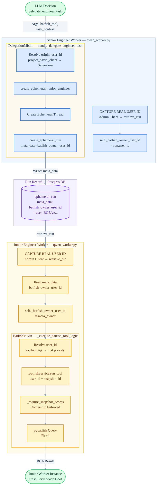

```mermaid
%%{init: {
  "theme": "base",
  "themeVariables": {
    "background": "#f8f9fc",
    "primaryColor": "#dbeafe",
    "primaryTextColor": "#1e3a5f",
    "primaryBorderColor": "#3b82f6",
    "secondaryColor": "#fef3c7",
    "secondaryTextColor": "#78350f",
    "secondaryBorderColor": "#f59e0b",
    "tertiaryColor": "#ede9fe",
    "tertiaryTextColor": "#4c1d95",
    "tertiaryBorderColor": "#7c3aed",
    "nodeTextColor": "#1e293b",
    "edgeLabelBackground": "#f1f5f9",
    "clusterBkg": "#f8faff",
    "clusterBorder": "#cbd5e1",
    "titleColor": "#1e293b",
    "lineColor": "#94a3b8",
    "fontSize": "16px",
    "fontFamily": "Georgia, serif"
  }
}}%%
graph TD
    LLM([LLM Decision\ndelegate_engineer_task])
    JuniorWorker([Junior Worker Instance\nFresh Server-Side Boot])

    subgraph Senior ["Senior Engineer Worker — qwen_worker.py"]
        direction TB
        CaptureUID[CAPTURE REAL USER ID\nAdmin Client → retrieve_run]
        SetOwner[self._batfish_owner_user_id\n= run.user_id]

        subgraph DelegationMixin ["DelegationMixin — handle_delegate_engineer_task"]
            direction TB
            ResolveOrigin[Resolve origin_user_id\nproject_david_client → Senior run]
            CreateJunior[create_ephemeral_junior_engineer]
            CreateThread[Create Ephemeral Thread]
            StampRun[create_ephemeral_run\nmeta_data=batfish_owner_user_id]
        end
    end

    subgraph DB ["Run Record — Postgres DB"]
        RunRecord[(ephemeral_run\nmeta_data: batfish_owner_user_id\n= user_BG5Jyz...)]
    end

    subgraph Junior ["Junior Engineer Worker — qwen_worker.py"]
        direction TB
        BootCapture[CAPTURE REAL USER ID\nAdmin Client → retrieve_run]
        ReadMeta[Read meta_data\nbatfish_owner_user_id]
        SetJuniorOwner[self._batfish_owner_user_id\n= meta_owner]

        subgraph BatfishMixin ["BatfishMixin — _execute_batfish_tool_logic"]
            direction TB
            ResolveUser[Resolve user_id\nexplicit arg → first priority]
            CallService[BatfishService.run_tool\nuser_id + snapshot_id]
            AccessCheck[_require_snapshot_access\nOwnership Enforced]
            QueryBatfish[pybatfish Query\nFiresl]
        end
    end

    LLM --> |"Args: batfish_tool, task_context"| ResolveOrigin
    CaptureUID --> SetOwner

    ResolveOrigin --> CreateJunior
    CreateJunior --> CreateThread
    CreateThread --> StampRun
    StampRun ==> |"Writes meta_data"| RunRecord

    RunRecord ==> |"retrieve_run"| BootCapture
    BootCapture --> ReadMeta
    ReadMeta --> SetJuniorOwner
    SetJuniorOwner --> ResolveUser
    ResolveUser --> CallService
    CallService --> AccessCheck
    AccessCheck --> QueryBatfish

    QueryBatfish -.-> |"RCA Result"| JuniorWorker

    %% Backend Senior: soft blue
    classDef main fill:#dbeafe,stroke:#3b82f6,stroke-width:1.5px,color:#1e3a5f

    %% Junior Worker: soft amber
    classDef worker fill:#fef3c7,stroke:#f59e0b,stroke-width:1.5px,color:#78350f

    %% DB Bridge: soft violet
    classDef bridge fill:#ede9fe,stroke:#7c3aed,stroke-width:1.5px,color:#4c1d95

    %% External: soft green
    classDef external fill:#dcfce7,stroke:#22c55e,stroke-width:1.5px,color:#14532d

    class CaptureUID,SetOwner,ResolveOrigin,CreateJunior,CreateThread,StampRun main
    class BootCapture,ReadMeta,SetJuniorOwner,ResolveUser,CallService,AccessCheck,QueryBatfish worker
    class RunRecord bridge
    class LLM,JuniorWorker external

    style Senior fill:#eff6ff,stroke:#93c5fd,color:#1e3a5f
    style DelegationMixin fill:#fef9ee,stroke:#fbbf24,color:#1e3a5f
    style DB fill:#f5f3ff,stroke:#a78bfa,color:#4c1d95
    style Junior fill:#fffbeb,stroke:#fcd34d,color:#78350f
    style BatfishMixin fill:#fef9ee,stroke:#fbbf24,color:#78350f
```