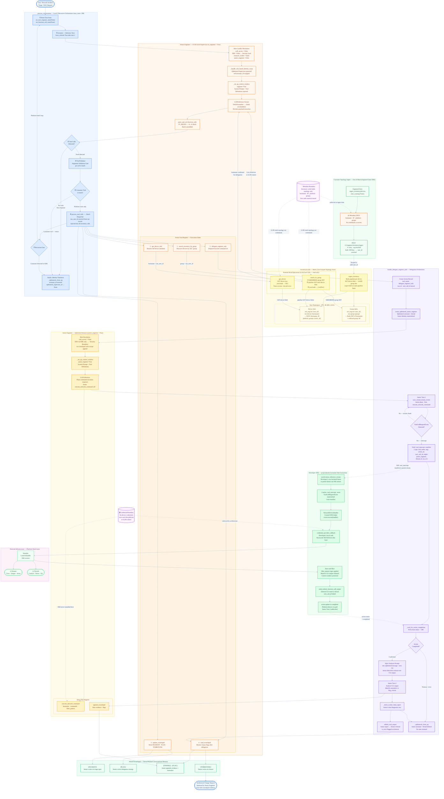

```mermaid
%%{init: {
  "theme": "base",
  "themeVariables": {
    "background": "#f8f9fc",
    "primaryColor": "#dbeafe",
    "primaryTextColor": "#1e3a5f",
    "primaryBorderColor": "#3b82f6",
    "secondaryColor": "#fef3c7",
    "secondaryTextColor": "#78350f",
    "secondaryBorderColor": "#f59e0b",
    "tertiaryColor": "#ede9fe",
    "tertiaryTextColor": "#4c1d95",
    "tertiaryBorderColor": "#7c3aed",
    "nodeTextColor": "#1e293b",
    "edgeLabelBackground": "#f1f5f9",
    "clusterBkg": "#f8faff",
    "clusterBorder": "#cbd5e1",
    "titleColor": "#1e293b",
    "lineColor": "#94a3b8",
    "fontSize": "15px",
    "fontFamily": "Georgia, serif"
  }
}}%%

graph TD

    %% ── Entry ──────────────────────────────────────────────────────────
    Incident([User: Network Incident\nTriage / BAU Request])

    %% ══════════════════════════════════════════════════════════════════
    %% CUSTOMER TOPOLOGY INGEST  (out-of-band, before any run)
    %% ══════════════════════════════════════════════════════════════════
    subgraph CustomerIngest ["Customer Topology Ingest  —  Out-of-Band  (EngineerClient SDK)"]
        direction LR
        EClient["EngineerClient\n.ingest_inventory(devices,\n clear_existing=False)"]
        IngestNote["⚠️ Metadata ONLY\nhostname · IP · platform · groups\nNo credentials or secrets"]
        IngestAPI["POST /v1/engineer/inventory/ingest\n3× retry · exp backoff\nAuth: API Key  →  user_id resolved"]
    end

    %% ══════════════════════════════════════════════════════════════════
    %% INVENTORY CACHE  (Platform-side Redis — user-scoped)
    %% ══════════════════════════════════════════════════════════════════
    subgraph InventoryCache ["InventoryCache  —  Redis  (User-Scoped Topology Store)"]
        direction TB

        subgraph KeySchema ["Key Namespace  ·  TTL: 86 400 s  (24 h)"]
            direction LR
            DevKey["Device blob\nnet_eng:usr:{user_id}\n  :inv:device:{hostname}\n→ JSON  {hostname, IP,\n   platform, groups, owner_id}"]
            GrpKey["Group index\nnet_eng:usr:{user_id}\n  :inv:group:{group}\n→ Redis SET  of hostnames\n+ wildcard group  'all'"]
        end

        IngestPipeline["ingest_inventory\nRedis pipeline per device\nSET device blob  +  SADD group sets\nexpire both on same pipeline flush"]

        subgraph ReadOps ["Runtime Read Operations  (LLM Tool Calls — read-only)"]
            direction LR
            SearchOp["search_by_group\n① SMEMBERS group SET\n② pipeline GET each device blob\n③ json.loads → List[Dict]"]
            GetOp["get_device\nGET device key\njson.loads → Dict\nNone on miss / decode error"]
        end
    end

    %% ── Orchestrator ───────────────────────────────────────────────────
    subgraph Orchestrator ["process_conversation — Level 3 Recursive Orchestrator  (max_turns: 200)"]
        direction TB
        TurnReset["① Reset Turn State\nset_tool_response_state(False)\nset_function_call_state(None)"]
        StreamInvoke["② stream() — Inference Turn\nforce_refresh=True after turn 1"]
        BatchCheck{"③ Tool Calls\nDetected?"}
        ValidGate["④ ToolValidator\nArgument Validation Gate\nper call in batch"]
        HasConsumer{"⑤ Consumer Tool\nin batch?"}
        ToolDispatch["⑥ process_tool_calls  —  Batch Dispatcher\nrun_user_id resolved from run record\ninjected into all inventory calls"]
        RecurseGate{"⑦ Recursion Gate"}
        IdentityRestore["finally: Identity Teardown\n_ephemeral_clean_up\nassistant_id restored\nephemeral_supervisor_id → None"]
    end

    %% ── Senior Engineer ────────────────────────────────────────────────
    subgraph SeniorEngineer ["Senior Engineer — CCIE-Level Supervisor  (is_engineer = True)"]
        direction TB
        RoleResolution["Role Conflict Resolution\nweb_access = False\nSSH = False  ←  Security Lock\nresearch_worker = False\njunior_engineer = False"]
        IdentitySwap["_handle_role_based_identity_swap\nEphemeral Supervisor spawned\nself.assistant_id swapped"]
        CtxBuild["_set_up_context_window\nengineer=True\nSystem Prompt + Tool Definitions injected"]
        LLMInfer["LLM Inference Stream\nDeltaNormalizer → chunk accumulation\nDecision payload extraction"]
        FCParse["parse_and_set_function_calls\nFC_REGEX  →  fc...fc block\nBatch assembled"]

        subgraph SeniorTools ["Senior Tool Register  —  Execution Order"]
            direction LR
            ST1["1 · search_inventory_by_group\nDiscover devices by role / group"]
            ST2["2 · get_device_info\nResolve full device metadata"]
            ST3["3 · update_scratchpad\nWrite INCIDENT · PLAN · TOMBSTONE"]
            ST4["4 · read_scratchpad\nMonitor Junior flags after delegation"]
            ST5["5 · delegate_engineer_task\nDispatch focused command set"]
        end
    end

    %% ── Shared Scratchpad ──────────────────────────────────────────────
    subgraph Scratchpad ["Shared Scratchpad  —  Thread-Pinned Conversational Memory"]
        direction LR
        SP_I["[INCIDENT]\nSenior writes on triage open"]
        SP_P["[PLAN]\nSenior writes delegation strategy"]
        SP_F["[FINDING] · [FLAG]\nJunior appends evidence + anomalies"]
        SP_T["[TOMBSTONE]\nSenior writes on closure"]
    end

    %% ── Delegation Mixin ───────────────────────────────────────────────
    subgraph Delegation ["handle_delegate_engineer_task  —  Delegation Orchestrator"]
        direction TB
        CreateAct["Create Action Record\ntool_name: delegate_engineer_task\nrun_id · tool_call_id stored"]
        SpawnJunior["create_ephemeral_junior_engineer\nEphemeral assistant + thread\nJunior identity materialised"]
        JTurn1["Junior Turn 1\nsync_stream.stream_events\nJunior plans · fires execute_network_command"]
        Intercept{"ToolCallRequestEvent\nDetected?"}
        YieldIntercept["Yield  tool_intercept  manifest\n{ type, tool_name, args, action_id,\n  tool_call_id, origin: junior_engineer,\n  thread_id, run_id }"]
        PollGate["_wait_for_action_completion\nPoll action status — DB"]
        TurnGate{"Action\nCompleted?"}
        InjectPrompt["Inject Analysis Prompt\nnew ephemeral message + new run\nJunior directed to reason over CLI output"]
        JTurn2["Junior Turn 2\nAnalyse CLI output\nIdentify anomalies vs flag_criteria"]
        FetchReport["_fetch_worker_final_report\nJunior's final diagnostic text"]
        SubmitBack["submit_tool_output\nJunior report → Senior's thread\nis_error flagged on timeout"]
        Cleanup["_ephemeral_clean_up\nJunior assistant + thread deleted\nNo state retained"]
    end

    %% ── Junior Engineer ────────────────────────────────────────────────
    subgraph JuniorEngineer ["Junior Engineer — Ephemeral Instance  (junior_engineer = True)"]
        direction TB
        JRole["Role Resolution\nweb_access = False\nSSH via SDK only  ←  Security Boundary\nno scratchpad write except append"]
        JCtx["_set_up_context_window\njunior_engineer=True\nSystem Prompt + Tool Definitions"]
        JInfer["LLM Inference\nPlans command execution sequence\nEmits execute_network_command call"]

        subgraph JuniorTools ["Junior Tool Register"]
            direction LR
            JT1["execute_network_command\nhostname · commands · filter_pattern"]
            JT2["append_scratchpad\nRaw evidence · flags"]
        end
    end

    %% ── SDK / Consumer Layer ───────────────────────────────────────────
    subgraph SDKLayer ["Developer SDK — projectdavid  (Consumer-Side Execution)"]
        direction TB
        DevStream["synchronous_inference_stream\nDeveloper's own backend listens\nto parent Senior run SSE stream"]
        CatchIntercept["Catches  tool_intercept  event\nToolCallRequestEvent materialised\nfrom manifest"]
        NetHandler["NetworkDeviceHandler\nCurated SDK helper\nevent.execute(handler)"]
        CredVault["credential_provider_callback\nDeveloper's local vault\nPasswords NEVER leave this layer"]
        StoreSlice["Store and Slice\nfilter_pattern regex applied\nMassive CLI output trimmed\nContext window protected"]
        SubmitResult["entity.submit_function_call_output\nFiltered CLI result to thread\ntool_call_id linked"]
        MarkDone["action.update to completed\nPlatform detects via poll\nJunior Turn 2 unblocked"]
    end

    %% ── Network Devices ────────────────────────────────────────────────
    subgraph NetworkLayer ["Network Infrastructure  —  Platform-Dark Layer"]
        direction LR
        Netmiko["Netmiko\nConnectHandler\nSSH session"]
        Dev1(["L3 Router\nCisco · Juniper · Arista"])
        Dev2(["L2 Switch\nCatalyst · Nexus · EX"])
    end

    %% ── Security callouts ──────────────────────────────────────────────
    CredBarrier[("🔒 Credential Boundary\nNo device credentials\never reach the platform\nor LLM context")]

    MetaBarrier[("🔐 Metadata Boundary\nInventory cache holds\ntopology only\nhostname · IP · platform · groups\nZero auth material stored")]

    %% ── Output ─────────────────────────────────────────────────────────
    ChangeReq(["Synthesised Change Request\nAuthored by Senior Engineer\nfrom full scratchpad evidence"])

    %% ═══════════════════════════════════════════════════════════════════
    %% EDGES — Customer Ingest Path (out-of-band, pre-run)
    %% ═══════════════════════════════════════════════════════════════════
    EClient --> IngestNote
    IngestNote --> IngestAPI
    IngestAPI -->|"Scoped to\nauth user_id"| IngestPipeline
    IngestPipeline --> DevKey
    IngestPipeline --> GrpKey

    %% ═══════════════════════════════════════════════════════════════════
    %% EDGES — Runtime Inventory Reads
    %% ═══════════════════════════════════════════════════════════════════
    ST1 -->|"group + run_user_id"| SearchOp
    SearchOp -->|"SMEMBERS group SET"| GrpKey
    SearchOp -->|"pipeline GET device blobs"| DevKey
    SearchOp -->|"List of devices\nto LLM context"| LLMInfer

    ST2 -->|"hostname + run_user_id"| GetOp
    GetOp -->|"GET device blob"| DevKey
    GetOp -->|"hostname confirmed\nfor delegation"| LLMInfer

    %% ═══════════════════════════════════════════════════════════════════
    %% EDGES — Main Orchestration Flow
    %% ═══════════════════════════════════════════════════════════════════
    Incident --> TurnReset
    TurnReset --> StreamInvoke

    StreamInvoke --> RoleResolution
    RoleResolution --> IdentitySwap
    IdentitySwap --> CtxBuild
    CtxBuild --> LLMInfer
    LLMInfer --> FCParse
    FCParse --> BatchCheck

    BatchCheck -- "No tools\nText response" --> IdentityRestore
    BatchCheck -- "Tools detected" --> ValidGate
    ValidGate --> HasConsumer
    HasConsumer -- "Platform tools only" --> ToolDispatch
    HasConsumer -- "Consumer tool — return" --> IdentityRestore
    ToolDispatch --> RecurseGate
    RecurseGate -- "Platform batch loop" --> TurnReset
    RecurseGate -- "Consumer detected to SDK" --> IdentityRestore

    ToolDispatch --> ST1
    ToolDispatch --> ST2
    ToolDispatch --> ST3
    ToolDispatch --> ST4
    ToolDispatch --> ST5

    ST3 --> SP_I
    ST3 --> SP_P
    ST4 --> SP_F
    ST5 --> CreateAct
    SP_T --> ChangeReq

    CreateAct --> SpawnJunior
    SpawnJunior --> JRole
    JRole --> JCtx
    JCtx --> JInfer
    JInfer --> JT1
    JInfer --> JTurn1

    JTurn1 --> Intercept
    Intercept -- "No — stream chunk" --> JTurn1
    Intercept -- "Yes — intercept" --> YieldIntercept

    YieldIntercept -.->|"SSE: tool_intercept\nmanifest to parent stream"| DevStream
    DevStream --> CatchIntercept
    CatchIntercept --> NetHandler
    NetHandler --> CredVault
    CredVault --> Netmiko
    Netmiko --> Dev1
    Netmiko --> Dev2
    Netmiko --> StoreSlice
    StoreSlice --> SubmitResult
    SubmitResult --> MarkDone

    YieldIntercept --> PollGate
    MarkDone -.->|"action status\n= completed"| PollGate
    PollGate --> TurnGate
    TurnGate -- "Timeout / error" --> Cleanup
    TurnGate -- "Confirmed" --> InjectPrompt
    InjectPrompt --> JTurn2
    JTurn2 --> JT2
    JT2 --> SP_F
    JTurn2 --> FetchReport
    FetchReport --> SubmitBack
    SubmitBack --> ST4
    FetchReport --> Cleanup
    ST4 --> SP_T

    CredBarrier -. "enforced by architecture" .-> CredVault
    CredBarrier -. "SSH never tunnelled here" .-> JT1
    MetaBarrier -. "enforced at ingest time" .-> IngestNote
    MetaBarrier -. "LLM reads topology not credentials" .-> SearchOp
    MetaBarrier -. "LLM reads topology not credentials" .-> GetOp

    %% ═══════════════════════════════════════════════════════════════════
    %% CLASS DEFINITIONS
    %% ═══════════════════════════════════════════════════════════════════

    classDef main     fill:#dbeafe,stroke:#3b82f6,stroke-width:1.5px,color:#1e3a5f
    classDef senior   fill:#fff7ed,stroke:#f97316,stroke-width:1.5px,color:#7c2d12
    classDef worker   fill:#fef3c7,stroke:#f59e0b,stroke-width:1.5px,color:#78350f
    classDef bridge   fill:#ede9fe,stroke:#7c3aed,stroke-width:1.5px,color:#4c1d95
    classDef sdk      fill:#dcfce7,stroke:#22c55e,stroke-width:1.5px,color:#14532d
    classDef external fill:#f0fdf4,stroke:#4ade80,stroke-width:1.5px,color:#14532d
    classDef memory   fill:#ecfdf5,stroke:#10b981,stroke-width:1.5px,color:#064e3b
    classDef cache    fill:#fef9c3,stroke:#eab308,stroke-width:1.5px,color:#713f12
    classDef cachekey fill:#fefce8,stroke:#ca8a04,stroke-width:1px,color:#713f12
    classDef secret   fill:#fdf4ff,stroke:#a855f7,stroke-width:2px,color:#581c87
    classDef output   fill:#eff6ff,stroke:#3b82f6,stroke-width:2px,color:#1e3a5f
    classDef ingest   fill:#f0fdf4,stroke:#16a34a,stroke-width:1.5px,color:#14532d
    classDef warn     fill:#fff7ed,stroke:#ea580c,stroke-width:1.5px,color:#7c2d12

    class TurnReset,StreamInvoke,BatchCheck,ValidGate,HasConsumer,ToolDispatch,RecurseGate,IdentityRestore main
    class RoleResolution,IdentitySwap,CtxBuild,LLMInfer,FCParse senior
    class ST1,ST2,ST3,ST4,ST5 senior
    class JRole,JCtx,JInfer,JT1,JT2 worker
    class CreateAct,SpawnJunior,JTurn1,Intercept,YieldIntercept,PollGate,TurnGate,InjectPrompt,JTurn2,FetchReport,SubmitBack,Cleanup bridge
    class DevStream,CatchIntercept,NetHandler,CredVault,StoreSlice,SubmitResult,MarkDone sdk
    class Netmiko,Dev1,Dev2 external
    class SP_I,SP_P,SP_F,SP_T memory
    class IngestPipeline,SearchOp,GetOp cache
    class DevKey,GrpKey cachekey
    class CredBarrier,MetaBarrier secret
    class Incident,ChangeReq output
    class EClient,IngestAPI ingest
    class IngestNote warn

    style CustomerIngest  fill:#f0fdf4,stroke:#86efac,color:#14532d
    style InventoryCache  fill:#fefce8,stroke:#fde047,color:#713f12
    style KeySchema       fill:#fffbeb,stroke:#fcd34d,color:#78350f
    style ReadOps         fill:#fefce8,stroke:#eab308,color:#713f12
    style Orchestrator    fill:#eff6ff,stroke:#93c5fd,color:#1e3a5f
    style SeniorEngineer  fill:#fff7ed,stroke:#fb923c,color:#7c2d12
    style SeniorTools     fill:#fef3e2,stroke:#fbbf24,color:#78350f
    style Delegation      fill:#f5f3ff,stroke:#a78bfa,color:#4c1d95
    style JuniorEngineer  fill:#fffbeb,stroke:#fcd34d,color:#78350f
    style JuniorTools     fill:#fef9ee,stroke:#fbbf24,color:#78350f
    style SDKLayer        fill:#f0fdf4,stroke:#86efac,color:#14532d
    style NetworkLayer    fill:#fdf2f8,stroke:#e879f9,color:#701a75
    style Scratchpad      fill:#ecfdf5,stroke:#6ee7b7,color:#064e3b
```