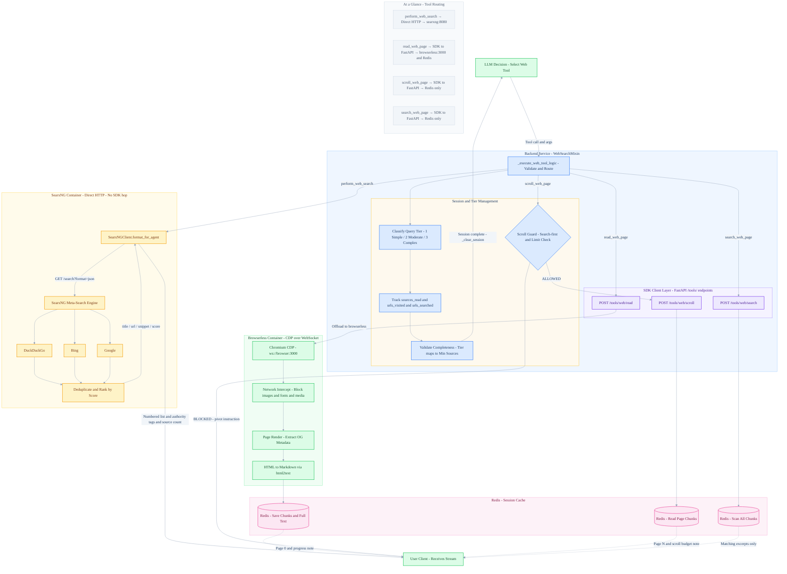

```mermaid
%%{init: {
  "theme": "base",
  "themeVariables": {
    "background": "#f8f9fc",
    "primaryColor": "#dbeafe",
    "primaryTextColor": "#1e3a5f",
    "primaryBorderColor": "#3b82f6",
    "secondaryColor": "#fef3c7",
    "secondaryTextColor": "#78350f",
    "secondaryBorderColor": "#f59e0b",
    "tertiaryColor": "#ede9fe",
    "tertiaryTextColor": "#4c1d95",
    "tertiaryBorderColor": "#7c3aed",
    "nodeTextColor": "#1e293b",
    "edgeLabelBackground": "#f1f5f9",
    "clusterBkg": "#f8faff",
    "clusterBorder": "#cbd5e1",
    "titleColor": "#1e293b",
    "lineColor": "#94a3b8",
    "fontSize": "16px",
    "fontFamily": "Georgia, serif"
  }
}}%%
flowchart TD
    LLM["LLM Decision - Select Web Tool"]
    User["User Client - Receives Stream"]

    subgraph Backend ["Backend Service - WebSearchMixin"]
        direction TB
        MixinStart["_execute_web_tool_logic - Validate and Route"]

        subgraph SessionLogic ["Session and Tier Management"]
            ClassifyTier["Classify Query Tier - 1 Simple / 2 Moderate / 3 Complex"]
            TrackSources["Track sources_read and urls_visited and urls_searched"]
            ScrollGuard{"Scroll Guard - Search-first and Limit Check"}
            ValidateResearch["Validate Completeness - Tier maps to Min Sources"]
        end

        subgraph SDKLayer ["SDK Client Layer - FastAPI /tools/ endpoints"]
            SDKRead["POST /tools/web/read"]
            SDKScroll["POST /tools/web/scroll"]
            SDKSearch["POST /tools/web/search"]
        end
    end

    subgraph SearxNGLayer["SearxNG Container - Direct HTTP - No SDK hop"]
        SearxNGClient["SearxNGClient.format_for_agent"]
        SearxNGEngine["SearxNG Meta-Search Engine"]
        DDG["DuckDuckGo"]
        Bing["Bing"]
        Google["Google"]
        Dedup["Deduplicate and Rank by Score"]
    end

    subgraph BrowserLayer["Browserless Container - CDP over WebSocket"]
        BrowserConn["Chromium CDP - ws://browser:3000"]
        NetIntercept["Network Intercept - Block images and fonts and media"]
        PageRender["Page Render - Extract OG Metadata"]
        MarkdownConv["HTML to Markdown via html2text"]
    end

    subgraph CacheLayer["Redis - Session Cache"]
        RedisWrite[("Redis - Save Chunks and Full Text")]
        RedisRead[("Redis - Read Page Chunks")]
        RedisSearch[("Redis - Scan All Chunks")]
    end

    subgraph ToolRoutingTable ["At a Glance - Tool Routing"]
        T1["perform_web_search → Direct HTTP → searxng:8080"]
        T2["read_web_page → SDK to FastAPI → browserless:3000 and Redis"]
        T3["scroll_web_page → SDK to FastAPI → Redis only"]
        T4["search_web_page → SDK to FastAPI → Redis only"]
    end

    LLM -->|"Tool call and args"| MixinStart
    MixinStart --> ClassifyTier
    ClassifyTier --> TrackSources

    MixinStart -->|"perform_web_search"| SearxNGClient
    SearxNGClient -->|"GET /search?format=json"| SearxNGEngine
    SearxNGEngine --> DDG
    SearxNGEngine --> Bing
    SearxNGEngine --> Google
    DDG --> Dedup
    Bing --> Dedup
    Google --> Dedup
    Dedup -->|"title / url / snippet / score"| SearxNGClient
    SearxNGClient -->|"Numbered list and authority tags and source count"| User

    MixinStart -->|"read_web_page"| SDKRead
    SDKRead -->|"Offload to browserless"| BrowserConn
    BrowserConn --> NetIntercept
    NetIntercept --> PageRender
    PageRender --> MarkdownConv
    MarkdownConv --> RedisWrite
    RedisWrite -.->|"Page 0 and progress note"| User

    MixinStart -->|"scroll_web_page"| ScrollGuard
    ScrollGuard -->|"BLOCKED - pivot instruction"| User
    ScrollGuard -->|"ALLOWED"| SDKScroll
    SDKScroll --> RedisRead
    RedisRead -.->|"Page N and scroll budget note"| User

    MixinStart -->|"search_web_page"| SDKSearch
    SDKSearch --> RedisSearch
    RedisSearch -.->|"Matching excerpts only"| User

    TrackSources --> ValidateResearch
    ValidateResearch -->|"Session complete - _clear_session"| LLM

    classDef main fill:#dbeafe,stroke:#3b82f6,stroke-width:1.5px,color:#1e3a5f
    classDef worker fill:#fef3c7,stroke:#f59e0b,stroke-width:1.5px,color:#78350f
    classDef bridge fill:#ede9fe,stroke:#7c3aed,stroke-width:1.5px,color:#4c1d95
    classDef external fill:#dcfce7,stroke:#22c55e,stroke-width:1.5px,color:#14532d
    classDef cache fill:#fce7f3,stroke:#ec4899,stroke-width:1.5px,color:#831843
    classDef tableNode fill:#f1f5f9,stroke:#cbd5e1,stroke-width:1px,color:#475569

    class MixinStart,ClassifyTier,TrackSources,ScrollGuard,ValidateResearch main
    class SDKRead,SDKScroll,SDKSearch bridge
    class SearxNGClient,SearxNGEngine,DDG,Bing,Google,Dedup worker
    class BrowserConn,NetIntercept,PageRender,MarkdownConv external
    class RedisWrite,RedisRead,RedisSearch cache
    class T1,T2,T3,T4 tableNode
    class LLM,User external

    style Backend fill:#eff6ff,stroke:#93c5fd,color:#1e3a5f
    style SessionLogic fill:#fef9ee,stroke:#fbbf24,color:#1e3a5f
    style SDKLayer fill:#f5f3ff,stroke:#a78bfa,color:#4c1d95
    style SearxNGLayer fill:#fffbeb,stroke:#fcd34d,color:#78350f
    style BrowserLayer fill:#f0fdf4,stroke:#86efac,color:#14532d
    style CacheLayer fill:#fdf2f8,stroke:#f9a8d4,color:#831843
    style ToolRoutingTable fill:#f8fafc,stroke:#cbd5e1,color:#475569
```